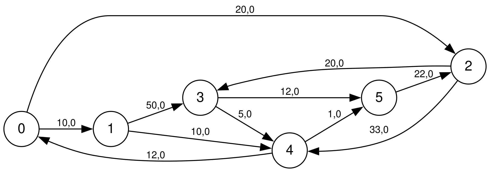
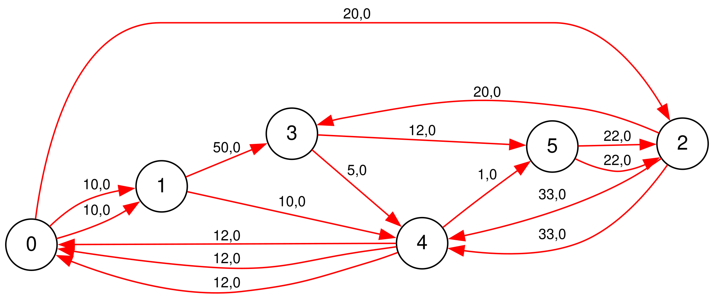

# Problema do Carteiro Chinês (PCC) - Circuito Euleriano

## 📋 Sobre o Projeto
Este projeto foi desenvolvido para a disciplina de **Resolução de Problemas com Grafos**. O objetivo é encontrar o caminho de custo mínimo que percorra todas as arestas de um dígrafo ponderado pelo menos uma vez, retornando ao ponto de origem.

## 🧠 Metodologia Aplicada
A resolução foi dividida em duas etapas fundamentais:

1.  **Eulerização Manual:** Análise detalhada do grafo original para identificar vértices desbalanceados ($d_{in} \neq d_{out}$). Foram adicionadas arestas baseadas em caminhos reais para tornar o grafo euleriano.
2.  **Implementação Computacional:** Utilização do **Método de Hierholzer** para extrair o circuito euleriano a partir da instância balanceada.

### Diferencial Técnico: Fidelidade Topológica
Diferente de abordagens que utilizam "atalhos" ou arestas fictícias, esta implementação utiliza **16 arestas** para garantir que:
* Apenas ruas existentes no mapa original fossem duplicadas.
* O balanceamento dos vértices fosse absoluto, permitindo a execução correta do algoritmo.
* O custo total de **284.00** representasse um trajeto real e executável.

---

## 📊 Visualização dos Grafos

### 1. Grafo Original
Instância oficial utilizada como base para a identificação dos vértices desbalanceados.
<br>


### 2. Grafo Eulerizado (Solução)
Visualização gerada via **Graphviz** onde as arestas repetidas para eulerização são destacadas.
<br>


---

## 🚀 Como Executar

### Pré-requisitos
* Java JDK 11 ou superior.
* Biblioteca `algs4` no diretório `lib/`.

### Comandos
1. Compile o projeto:
   ```bash
   javac -d . src/Main.java lib/*.java